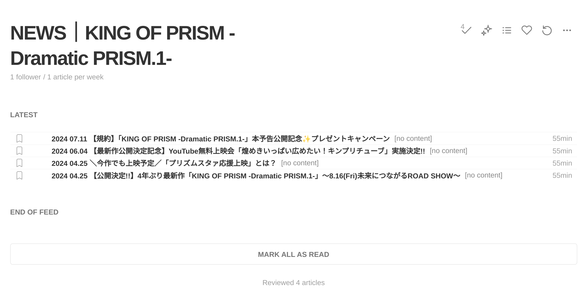
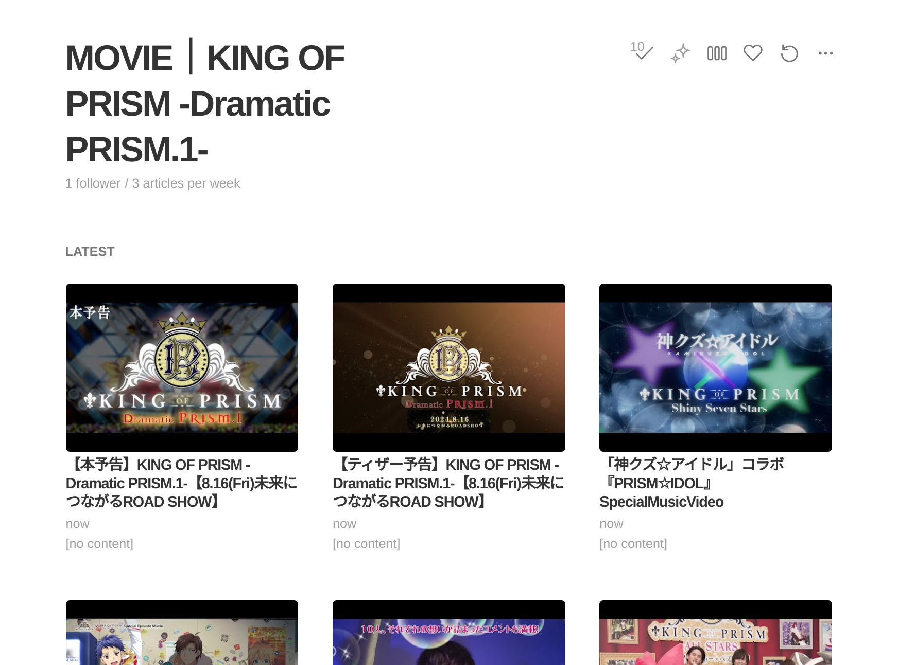
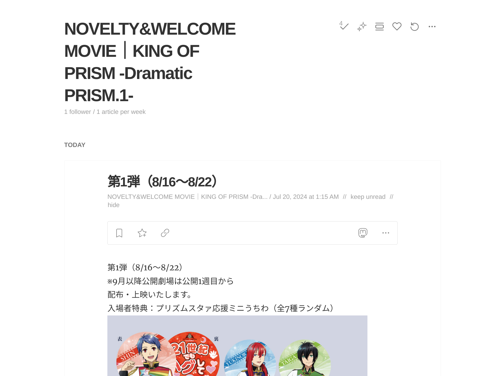

 
## まえがき

Elon MuskによってTwitterのpublicなタイムラインが壊されてしまった今では、ログアウトした状態だとプロフィールページにアクセスしても、ランダムな過去の人気ツイート？が表示されるだけで、最新のツイートを読むことはもう不可能になってしまった。アカウントを持っていない人にとっては、もうほとんどのツイートがインターネット上では公開されてなくなってアクセスできなくなってしまっている。そんなものはpublic squareでも何でもないよね…。

Twitter以外でも、まだキンプリ公式サイトは一応更新してくれているから、そこをチェックすればまだ重要な情報は一部だけは知ることはできるみたい。でも、どうやらRSSフィードを正しく作成できていないみたいなので、そのままでは[RSSリーダー](https://ja.wikipedia.org/wiki/RSS)で購読して更新をチェックできなかった。

チェックするウェブサイトがたくさんあるのに、いつ更新があるのかわからないウェブサイトを手動で何度も確認するのはとっても不便なので、仕方がないのでRSSフィードを作ることにした。

オンライン上のRSSフィード作成サービスは有料でオープンソースでないものがほとんどだけれど、[RSS Bridge](https://rss-bridge.org/)というオープンソースのアプリを使ったら期待通りのフィードが作れた。ハピなる♪

## RSSフィードの例

たとえば、[Feedly](https://feedly.com/)でRSSフィードを購読すると、こんな感じで各ページの更新が確認できる。

## RSSフィード（Atom）一覧

それぞれのフィードが公式ウェブサイトのページに対応してる。DiscographyやMovieページは、サムネイル画像が表示されるように追加要素を設定してるよ。

- Newsページ: https://rss-bridge.org/bridge01/?action=display&bridge=XPathBridge&url=https%3A%2F%2Fkinpri.com%2Fnews%2F&item=%2F%2Fa%5B%40class%3D%22p-news__list-inner%22%5D&title=.&content=&uri=.%2F%40href&author=&timestamp=.%2F%2F%5B%40class%3D%22p-news__list-date%22%5D&enclosures=&categories=&format=Atom
- Eventページ: https://rss-bridge.org/bridge01/?action=display&bridge=XPathBridge&url=https%3A%2F%2Fkinpri.com%2Fevent%2F&item=%2F%2Fa%5B%40class%3D%22p-event__list-inner%22%5D&title=.&content=&uri=.%2F%40href&author=&timestamp=.%2F%2F%5B%40class%3D%22p-news__list-date%22%5D&enclosures=&categories=&format=Atom
- Discographyページ: https://rss-bridge.org/bridge01/?action=display&bridge=XPathBridge&url=https%3A%2F%2Fkinpri.com%2Fdiscography%2F&item=%2F%2Fli%5B%40class%3D%22p-disco__list-item%22%5D&title=.&content=&raw_content=on&uri=&author=&timestamp=&enclosures=substring-after%28substring-before%28.%2F%2Fdiv%5B%40class%3D%22p-disco__list-thumb-img%22%5D%2F%40style%2C+%22%29%22%29%2C+%22%28%22%29&categories=&format=Atom
- Noveltyページ: https://rss-bridge.org/bridge01/?action=display&bridge=XPathBridge&url=https%3A%2F%2Fkinpri.com%2Fnovelty%2F&item=%2F%2Fdiv%5Bstarts-with%28%40id%2C+%22novelty_%22%29%5D&title=.%2F%2Fdiv%5B%40class%3D%22p-novelty__box-head-text%22%5D&content=.&raw_content=on&uri=&author=&timestamp=&enclosures=&categories=&format=Atom
- Movieページ: https://rss-bridge.org/bridge01/?action=display&bridge=XPathBridge&url=https%3A%2F%2Fkinpri.com%2Fmovie%2F&item=%2F%2Fli%5B%40class%3D%22p-movie__list-item%22%5D&title=.&content=&raw_content=on&uri=&author=&timestamp=&enclosures=substring-after%28substring-before%28.%2F%2Fdiv%5B%40class%3D%22p-movie__list-thumb-img%22%5D%2F%40style%2C+%22%29%22%29%2C+%22%28%22%29&categories=&format=Atom

ちなみに、一番最後の`format=Atom`を`format=html`に変更すると、RSS Bridge上でプレビューが見れる。

今は公開されている[RSS Bridgeの無料サーバー](https://rss-bridge.org/bridge01/)を借りて使っているけれど、もっと多く使うようなら自分用のRSS Bridgeサービスを用意してもいいかもしれないね。
