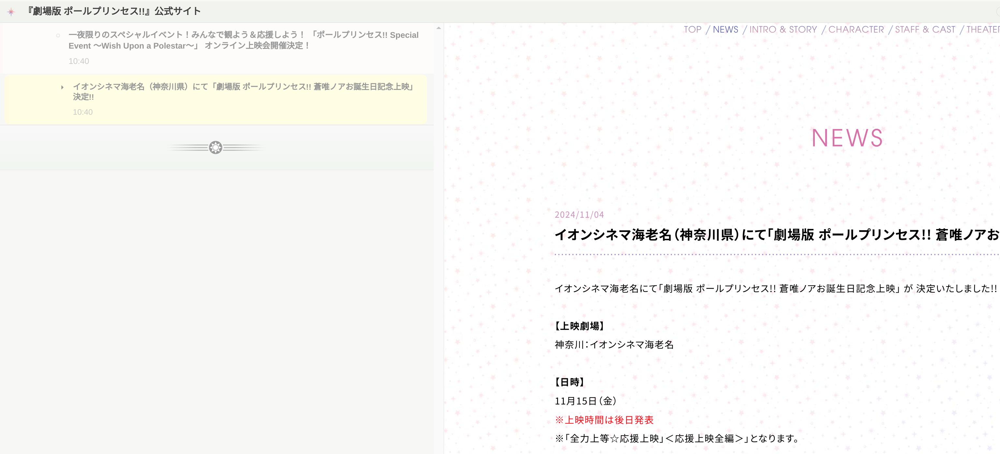

## ニュースページのRSSフィード

[『ポールプリンセス!!』の新しいニュースページ](https://poleprincess.jp/news/)のために、[[kinpri-official-website-rss|『KING OF PRISM』公式ウェブサイトのRSSフィードを作ったよ]]と同じようなRSSフィードを作ったよ。

News: https://rss-bridge.org/?action=display&bridge=XPathBridge&url=https%3A%2F%2Fpoleprincess.jp%2Fnews%2F&item=%2F%2Farticle&title=.%2F%2Fh2&content=&uri=.%2F%2Fa&author=&timestamp=.%2F%2Ftime&enclosures=&categories=&format=Atom

RSSリーダーでこのURLを購読すると、たとえば次のようにRSSリーダー上で更新通知を受け取って、新しいニュースをチェックできる。

## 以前のTumblrのRSS機能

『ポールプリンセス!!』公式ウェブサイトのニュースページは、以前は無料版のTumblrアカウントで作られていた（<https://poleprincess-news.tumblr.com/>）。TumblrはデフォルトでRSSを提供してくれているので、好きなページのURLの終わりに`/rss`を付けるだけで、RSSフィードを取得できていた。

たとえば、全ニュースのRSSフィードは、<https://poleprincess-news.tumblr.com/rss>で表示できるし、タグ別のページのRSSも取得できていた（ポールプリンセスのページは毎回同じタグを固定で付けていたから、この場合あまり意味はないけど）。

## オープンでアクセシブルな情報公開

ウェブ上の定期的に更新されるすべてのウェブサイトには、ウェブ標準であるRSSを実装してほしいな。そしてすべてのソーシャルメディアの投稿と同等の情報も、インターネットを利用するすべての人にアクセス可能にしてほしい。

特定のクローズなプラットフォームのみで情報を公開するということは、利用者をそのサービスにtrapするか、一部のユーザーを排除することになってしまって、情報のアクセシビリティが損なわれてしまうから。それに、その情報のアーカイブができない可能性も上がって、記録に残らずに人類の歴史から失われてしまうかもしれないんだよ。
