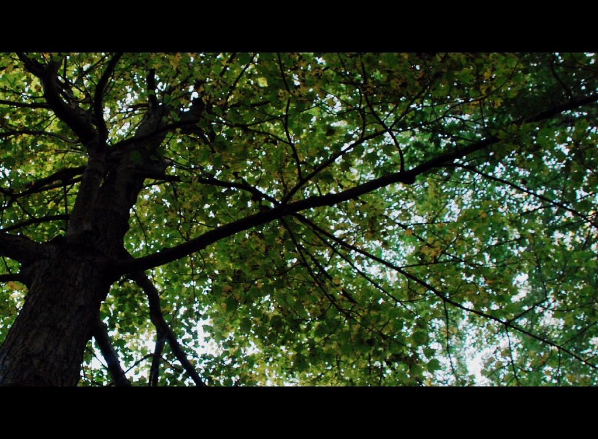

by さくらもち

---

2013年1月21日にPixivに投稿した『ドキドキ！プリキュア』のマナりつのお話です。

下に書いた通りだけれど、なぜかそらとさんが1話の放送すら始まってない時点で設定や予告だけからマナりつに夢中になっていて(笑)、その影響を受けて私もマナりつのことを寝ても覚めても考えるようになってしまっていました。その時に書いてしまった、初めてインターネット上で公開した二次創作がこのお話。

今、久しぶりに読みかえしたら、困っている人や悲しんでいる人を絶対に助けずにはいられないマナちゃんの愛が暖かくて、泣いてしまいました。

書いた半年後くらいに公開された秋の『マナ結婚!?』の映画にどことなく通じるものがあって、不思議な気持ちになった思い出があります💗

もともとのPixivのページのURLは https://www.pixiv.net/novel/show.php?id=1919079 だったけれど、今は[[pixiv-delete-account|Pixivアカウントを削除]]してしまったので404 Not Foundです。一応アカウント削除前に保存したページの[アーカイブ](https://archive.is/N6c0q)があります。

画像の出典: [Tree - leaf canopy | This tree keeps the front of my house cool in the summer. | Flickr](https://www.flickr.com/photos/blmiers2/6814372181) (ライセンス: [CC BY-NC-SA 2.0](https://creativecommons.org/licenses/by-nc-sa/2.0/))

---
          
**公開時のまえがき**

初めての投稿です。どきどき。『ドキドキ！プリキュア』の六花が小学生になる前、マナと出会うまでのお話です。公式ウェブページや予告などのデータをもとに作りました。普段はあまりお話を書かないのですが、六花はどうしてそんなに勉強ができるんだろうとか、マナとはどんなふうに出会って、どんな関係を築いてきたのかな、と考えながら書きました。ほとんど想像です。本編が始まってみたら、六花の性格とはずれているかもしれません。それから、いろいろな人の想像やイラストにも影響を受けました。特に一番大きな影響を受けたのは、[そらとさん(user/2466132)](https://www.pixiv.net/users/2466132)が描かれたかわいいマナりつのイラストです。とても仲良しな幼なじみの二人を見ていると、いろいろな想像ができました。素敵な絵を描いてくださって、ありがとうございます。『スマイルプリキュア！』ではなおれいが好きだったのですが、ふたりの関係は期待していたよりも深く描いてもらえなくて少し残念でしたが、マナと六花は、はっきりと幼なじみであることが書かれているし、お互いに助け合って支えあっている、ということなので、昔のできごとなども、たくさん、丁寧に描いてもらえるといいな、と期待しています。

---

ずっと昔、まだ幼稚園にも通っていなかった頃から、私の両親は仕事が忙しく、二人とも、夜遅くまで帰って来られないことが多かった。そんな両親を見ていたためか、私は、物心がついた時には、お父さんとお母さんが働いている間は、自分がしっかりお家を守らなくちゃいけない、という気持ちを持っていた。

「六花はしっかりもので偉いわね」

よくお母さんにそう言われた。そんなふうに褒められると、自分の務めを立派に果たしたのだと認められたようで、とても誇らしい気持ちになった。それでも、まだ小さかった子どもの私には、お父さんやお母さんと過ごす時間が少ないのは、やっぱり、少し寂しいことだった。

私が小さい頃は、家には家政婦さんがいて、家事や身の回りの世話をしてくれていた。それに、私にはおばあちゃんがいた。私は、おばあちゃんのことが大好きだった。

朝、私の目が覚める時間には、お父さんもお母さんも仕事に出かけてしまっていることが多かった。私が起きて、居間に入ると、おばあちゃんはいつも、部屋の隅に置かれたおばあちゃん専用の寝椅子に座って、本を読んでいた。部屋に入ってきた私を見ると、いつも、しわくちゃの顔をもっとしわくちゃにして、私ににっこりと笑いかけてくれた。そして、家政婦さんが準備してくれた朝食を、私と一緒に食べた。

食事が終わり、私と一緒に「ごちそうさまでした」と言うと、「いつも、ありがとうね」と家政婦さんに言って、また寝椅子に座って、本を読んだ。おばあちゃんは、哲学や歴史や古典文学の本を読むことが多かったけれど、時々、数学や科学の本も読んでいた。英語やフランス語で書かれた本を読んでいることもあった。

私は、午前中は、家の中で一人で遊んでいた。画用紙に絵を描いたり、絵本やお話の本を読んだりして過ごした。おばあちゃんが本を読むのを邪魔しちゃいけないと思って、いつも、息を潜めて、静かに遊んでいた。

だけど、私は静かなことは嫌いではなかった。しんと静まった部屋で遊んでいると、家の周りに植えられた木が風に揺れて、さわさわと静かな音がしたり、その木に、ときどき小鳥がとまって、ぴちぴちと小さな声を聞かせてくれた。近くの道を走る車の音や、遠くを走る鉄道の音も聞こえた。

私のおばあちゃんは、お父さんやお母さんと会えない寂しさをすっかり忘れさせてしまうくらい、お話が上手だった。お昼になると、朝ごはんと同じように、同じテーブルでお昼ごはんを食べた。その後、おばあちゃんは、居間にある柔らかい大きなソファに座り、「六花、少しこちらへおいで」と言って、私を膝の上に座らせてくれた。そうして、居心地の良い居間のふわふわとしたソファに座って、しわくちゃな手で私を暖かく抱きかかえながら、私の大好きなおばあちゃんは、やさしく、けれど、しっかりとした声で、私にお話を聞かせてくれた。

おばあちゃんは、本当にたくさんの、本当にいろいろなお話を聞かせてくれた。私は、おばあちゃんのお話を聞くのが何よりも大好きだった。最近、近所であった面白いできごとのお話。お母さんがまだ子供だった頃のお話（おばあちゃんは、私のお母さんのお母さんなのだ）。私たちが住んでいる地方に伝わる古い昔話。60年前に経験した戦争のお話。遠い外国のずっと昔の古いできごとのお話。ずっと昔のギリシャの伝説のお話。美しくて立派な王女様の冒険のお話。不思議な妖精と出会うお話。限りなくたくさんの本がある図書館のお話。狼に育てられた女の子のお話。月や星や太陽がどうして移り変わってゆくのかというお話。宇宙がどれだけ広くてどれだけ冷たいのかというお話。

まだ知らない新しいことを知るのは、とても楽しかった。おばあちゃんのお話を聞くと、私はもっともっといろんなお話を聞きたくなった。

「ねぇ、六花」

お話が終わるといつも、おばあちゃんは私にいろいろなことを尋ねた。

「六花はこれからどんなことをしてみたい？」

「六花はどんなことが好き？」

「六花はどんな人と出会いたい？」

私は、そんなおばあちゃんの質問が大好きだった。尋ねられるたびに、うーんと想像して、おばあちゃんのお話に負けないような、今の自分に考えられる限りの、いちばん素敵なお話を、一生懸命考えるのだ。

「うーんとね、六花はね、まだ誰も知らない、きれいな宝石を見つけてね、それをいっぱい、いっぱい集めて、世界中のみんなに配ってあげるの。そうしたら、みんな、そのきれいな宝石を見て、毎日、幸せな気持ちになるんだよ。それでね、その宝石は、緑と青と黄色が混ざった色なの。おひさまの光を当てると、もも色とだいだい色に、きらきら光るんだよ。おばあちゃんには、特別きれいなのをあげるね」

「まあ、それは素敵ね。六花ならできるわ。とってもやさしくて、賢い子だものね」

そう言われると、自分が本当に綺麗な宝石を見つけて、それをたくさんの人に贈ったつもりになれて、私の心は、嬉しい気持ちでいっぱいになった。

＊　＊　＊

大好きだったおばあちゃんが亡くなったのは、小学生になる前の春休みのことだった。それまで住んでいた地方の街から、新しい町に引っ越してきて1ヶ月くらい経ち、新しい家にも慣れてきたころだった。私たちはまた、前と同じような生活を送るようになっていた。

なのに、ある夜、眠ろうとして寝室の方へ歩いていると、廊下の途中でおばあちゃんがうずくまっていた。苦しそうなおばあちゃんのことをお父さんに知らせると、お父さんはすぐに救急車を呼んだ。お父さんは、おばあちゃんと一緒に救急車に乗り、病院へ行った。私とお母さんも、すぐに病院に駆けつけた。だけど、到着した時には、もう、おばあちゃんは亡くなっていた。

私は、少しも泣かなかった。おばあちゃんがいなくなったのだとは全然思えなかったからだ。少し変な気持ちがしたけれど、また、いつものような毎日が続くのだと思った。午前中は、ずっと使っていた居間の寝椅子で、いつものようにおばあちゃんが本を読んでいるような気がした。午後になると、おばあちゃんがお話をしてくれるのだと期待して、わくわくした気持ちになった。けれども、居間の寝椅子を見ても、家の中のどこに行っても、おばあちゃんの姿は見つからなかった。新しい家には、まだ私が知らない部屋があって、おばあちゃんは私を驚かせようとして、その部屋に隠れているのではないか。そんなふうに思って、家の中を何度も探した。だけど、おばあちゃんはどこにもいなかった。

何度も期待を裏切られているうちに、おばあちゃんは本当にいなくなってしまったのだ、という実感が強くなってきた。

お父さんも、お母さんも、家政婦さんも、いつも私にとても優しくしてくれた。けれども、おばあちゃんがいなければ、私は全然嬉しくなれなかった。

家にいると、いつでもおばあちゃんのことを思い出して、もどかしくなった。だから、その日、私はどうしても我慢できなくなって、家の外に出た。その日は、日差しが強くて、外はとても明るかったのに、空気は少しひんやりしていた。

私は、近くの大きな公園まで歩いた。遠くの広場では、小さな子どもたちがはしゃいで、笑い声を上げながら、おいかけっこをしていた。

どうして、笑っているのだろう。

いったい、何が楽しいんだろう。

楽しいことなんて、もう、どこを探しても、見つからないのに。

私は、公園の隅にある大きな樹の木陰に入った。枝が大きく広がっていて、葉がいっぱいに茂っていた。その幹に寄りかかりながら、私は、足もとの土を見つめていた。黒い、湿った、柔らかい土だった。その土を眺めていると、前に住んでいた町のことを思い出した。静かな町だった。その静かな町にある、静かな家で、私は、おばあちゃんのお話を聞いていたのだ。

柔らかいソファーのふかふかとした感じを思い出した。おばあちゃんのしわくちゃな手を思い出した。六花、と呼ぶ、大好きな声を思い出した。

おばあちゃんのいない世界なんて、いらない。

私は、こんな世界には、居たくない。

私はもう、どこにも居たくない。

背中を押す幹の柔らかさで、おばあちゃんに抱かれていた時の感じを思い出した。

息を吸い込むと、青葉の匂いがして、胸がぎゅっとなった。

「どうしたの？」

どれくらいそうしていたのかわからない。顔を上げると、すぐ隣に、私と同じくらいの歳の女の子が立っていた。その子は、私を心配そうに見つめていた。

「なにか悲しいことがあったの？」

私は、きっとすごく不機嫌な表情をしていただろう。誰とも話したくなかった。誰とも会いたくなかった。だから、私は、その子を無視するように、一度向けた視線を、また足もとに戻した。はっきりと拒む態度を取れば、きっとすぐに私から興味を失って、離れていくだろう。そう思って、一言も口を利かなかった。

けれども、その子は、ずっと同じ場所に立っていた。しばらく経っても、少しも離れる気配がなかった。

もう一度顔を上げて、その子の顔を見ると、その子は、小さく微笑んで、私を見つめていた。

この子は、どうして笑っているのだろう。

「ねえ、隣にいてもいい？」

「えっ？」

私は、どう答えればいいかわからなくて、曖昧にうなずくと、その子から目をそらして、また、自分の足元を見つめた。

＊　＊　＊

私たちは、同じ一つの木に背中を預けたまま、ずっと立っていた。

ときおり、穏やかな風が吹いて、頭の上の木の葉をさわさわと鳴らした。

木の葉の間から射した光が、私たちの足元に、きらきらと変化する影を作っていた。

女の子が息をする音が聞こえた。

さっきまでは聞こえなかったのに、自分が息をする音も、聞こえた。

木の葉の影をぼんやりと眺めていると、視界の端から、女の子の手が伸びてきた。

その手は、私の右手をそっとつかみ、両手で包み込んだ。

女の子は、大きな目で、私をじっと見つめていた。

「あなたの手、冷たいよ」

「ずっと、ここにいたから」

「どうして、ずっとここにいるの？」

「どうして？」

私も、女の子の目をじっと見つめていた。

とても、きれいな目だな、と思った。

すると、胸の下の方から、悲しい気持ちがどんどん膨らんできて、あっという間に、心がいっぱいになった。

涙があふれてきて、止まらなくなった。

もっともっと、きれいな目を見ていたかったのに。

女の子は、私が泣き始めると、すごく慌ててしまい、大丈夫、ごめんなさい、と何度も謝った。

私はそのたびに、空いた左手で涙を拭いながら、何度も首を振った。

ううん、違うの。

あなたは、何も悪くない。

誰も、何も悪くない。

悪いことなんて、なんにもない。

悪いことなんて、どこにもないんだ。

私は、ずっとずっと涙を流し続けた。

うまく息が吸えなくて、苦しくなったけれど、泣くのはやめられなかった。

私が泣いている間、女の子は、私の右手を、ずっと握ってくれていた。

私がその子の手に力を入れると、優しく握りかえしてくれた。

だんだん、悲しい気持ちが弱くなっていった。

息をするのが楽になってきた。

顔を上げてみると、女の子が私を見つめていた。

少し恥ずかしくなって、私はまた足元の土を見た。

それから、私は、女の子に全てのことを話した。大好きなおばあちゃんがいたこと、おばあちゃんがたくさんのお話をしてくれたこと、そのお話が大好きだったこと、引越しをしたこと、そして、おばあちゃんがいなくなってしまったこと、なにもかも、全部話した。

「ありがとう……。あの、あなたの、お名前は？」

「マナだよ。相田マナ」

「マナちゃん？」

「うん！」

「私は、菱川六花」

「りっか？ すっごくかわいい名前！ 六花ちゃんだね！」

マナは、にっこりと笑ってそう言うと、わたしの目をまっすぐ見て、言った。

「六花ちゃん」

「うん」

「六花ちゃん」

「うん」

「六花ちゃん」

「うん！」

私はきっと、まだひどい顔だっただろう。

だけど、マナと同じように、にっこりと笑っていた。 
